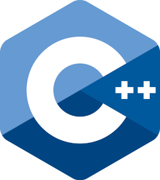

<p align="center">
  
</p>

<h2>SPIS TREŚCI</h2>

- [ENCODING](#encoding)
  - [POLSKIE ZNAKI](#polskie-znaki)
- [ZMIENNE](#zmienne)
  - [RODZAJ ZMIENNEJ](#rodzaj-zmiennej)
  - [TYPY ZMIENNEJ](#typy-zmiennej)
- [TABLICE](#tablice)
- [CIĄGI ZNAKÓW](#ciągi-znaków)
- [WEKTORY](#wektory)
- [ZNAKI SPECJALNE](#znaki-specjalne)
- [OPERATORY](#operatory)
  - [OPERATORY ARYTMETYCZNE](#operatory-arytmetyczne)
  - [OPERATORY RELACYJNE](#operatory-relacyjne)
  - [OPERATORY LOGICZNE](#operatory-logiczne)
  - [OPERATORY PRZYPISANIA](#operatory-przypisania)
  - [OPERATORY BINARNE](#operatory-binarne)
  - [OPERATOR SIZEOF](#operator-sizeof)
- [FUNKCJE MATEMATYCZNE](#funkcje-matematyczne)
- [PRZYTRZYMANIE KONSOLI](#przytrzymanie-konsoli)
- [POBIERANIE DANYCH OD UŻYTKOWNIKA](#pobieranie-danych-od-użytkownika)
- [INSTRUKCJE WARUNKOWE](#instrukcje-warunkowe)

---

## ENCODING

### POLSKIE ZNAKI

```cpp
setlocale(LC_CTYPE, "Polish");  // na pewno Windows i Linux
system("chcp 1250>null");       // tylko Windows
```

---

## ZMIENNE

### RODZAJ ZMIENNEJ

- `const` - stala [const int PI = 3.14;]

### TYPY ZMIENNEJ

- `int` - całkowita
- `float` - zmiennoprzecinkowa od 6 do 9 znaków
- `double` - zmiennoprzecinkowa od 15 do 18 znaków
- `char` - znak ASCII
- `string` - tekst
- `bool` - logiczny (true, false)

---

## TABLICE

**Jednowymiarowe**

```cpp
int oceny[6] = {1, 3, 5, 2, 6, 4};
cout << "ocena w indeksie na pozycji 2: " << oceny[2] << endl;
```

**Wielowymiarowe**

```cpp
int tablica[3][4] = {
    14, 13, 12, 11,
    26, 27, 28, 29,
    32, 34, 37, 39
};
cout << "pozycja w indeksie [0] i [3] to: " << tablica[0][3] << endl;
```

```cpp
float cukierki[2][2] = {
    1, 2,
    3, 4
};
cukierki[0][0] = 11;
cukierki[0][1] = 12;
```

---

## CIĄGI ZNAKÓW

Ciągi znaków możemy przechowywać również w formie tablicy np. `char imie[9] = "Adam";` wówczas program ciąg przechowa w sposób następujący `[A, d, a, m, \0, \0, \0, \0, \0]` brakujące miejsca uzupełni znak null

```cpp
// przyklad 1
char imie[5] = "Adam";
cout << imie << endl;

// przyklad 2
char imie_1[] = "Adam";
cout << imie_1 << endl;

// przyklad 3
char imie_2[] = {'A', 'd', 'a', 'm', '\0'};
cout << imie_2 << endl;

// przyklad 4
char ciag[20] = "Programowanie";
cout << ciag << endl;
cout << ciag[4] << endl;

// przyklad 6 wymaga biblioteke <cstring>
char auto_1[20], auto_2[20];
cout << "Podaj nazwe auta 1: " << endl;
cin >> auto_1;
cout << "Podaj nazwe auta 2: " << endl;
cin >> auto_2;
cout << "Twoje auto to: " << auto_1 << endl << auto_2 << endl;
strcpy(auto_2, auto_1);
cout << "A teraz twoje auta to: " << auto_1 << endl << auto_2 << endl;

// przyklad 7 (wymaga biblioteke <cstring>)
char imie[20], nazwisko[20];
cout << "Podaj swoje imie: ";
cin >> imie;
cout << "Podaj swoje nazwisko: ";
cin >> nazwisko;
strcat(imie, " ");
strcat(imie, nazwisko);
cout << "Twoje dane to: " << imie << endl;
```

---

## WEKTORY

**WEKTORY** - są jak tablice, ale pamięć automatycznie się dostosowuje do ilości elementów w wektorze

```cpp
#include <iostream>
#include <vector>

using namespace std;

int main()
{

    vector <int> liczby {4, 3, 2, 1};
    vector <char> samogloski {'a', 'o', 'i' , 'e', 'u'};

    cout << "WEKTORY" << endl;

    cout << "Liczba na pozycji 3 to: " << liczby[2] << endl;
    cout << "Ilosc elementow w wektorze liczby: " << liczby.size() << endl;

    cout << "Samogloska na pozycji 3 to: " << samogloski[2] << endl;

    liczby.push_back(21);

    cout << "Dodana liczba na pozycji 4 to: " << liczby[3] << endl;
    cout << "Ilosc elementow w wektorze po dodaniu elementu: " << liczby.size() << endl;

    return 0;
}
```

---

## ZNAKI SPECJALNE

- `\n` - koniec wiersza
- `\a` - alert
- `\t` - tabulator
- `\"` - cudzysłów
- `\'` - apostrof
- `\?` - pytajnik
- `\\` - backslash

---

## OPERATORY

### OPERATORY ARYTMETYCZNE

- `+` - dodawanie, np. 13 + 12 = 25
- `-` - odejmowanie, np. 13 - 12 = 1
- `*` - mnożenie, np. 13 \* 12 = 156
- `/` - dzielenie, np. 13 / 12 = 1.083
- `%` - modulo - reszta z dzielenia, np. 13 % 12 = 1

### OPERATORY RELACYJNE

- `++` - inkrementacja, np. liczba++;
- `--` - dekrementacja, np. liczba--;

**liczba++ vs ++liczba**

**liczba++** - inkrementacja, najpierw wykonuje jakieś równanie później inkrementuje

**++liczba** - preinkrementacja, najpierw liczbę wykonuje później wykonuje jakieś równanie

- `==` - równa, np. liczba_1 == liczba_2
- `<` - mniejsza, np. liczba_1 < liczba_2
- `>` - większa, np. liczba_1 > liczba_2
- `<=` - mniejsza równa, np. liczba_1 <= liczba_2
- `>=` - większa równa, np. liczba_1 >= liczba_2
- `!=` - różna, np. liczba_1 != liczba_2

### OPERATORY LOGICZNE

**AND:**

```cpp
// jest prawdą jeśli liczba_1 jest podzielna przez 2 i liczba_2 jest podzielna przez 2
wynik = (((liczba_1 % 2) == 0) && ((liczba_2 % 2) == 0));
```

**OR:**

```cpp
// jest prawdą jeśli pin jest równy PIN_1 albo pin jest równy PIN_2
dostep = ((pin == PIN_1) || (pin == PIN_2));
```

### OPERATORY PRZYPISANIA

- `+=`
- `-=`
- `*=`
- `%=`

```cpp
int liczba_1 = 8, liczba_2 = 3, wynik = 0;

wynik += liczba_1 + liczba_2;
cout << "+= " << wynik << endl; // 8 + 3 = 11

wynik -= liczba_1;
cout << "-= " << wynik << endl; // 11 - 8 = 3

wynik *= liczba_2;
cout << "*= " << wynik << endl; // 3 * 3 = 9

wynik %= liczba_2;
cout << "%= " << wynik << endl; // 9 % 3 = 0
```

### OPERATORY BINARNE

- **&** - AND
- **|** - OR
- **^** - XOR
- **~** - NOT
- **<<** - przesuniecie bitowe w lewo
- **>>** - przesuniecie bitowe w prawo

```cpp
int bin_1, bin_2, wynik;

bin_1 = 13; // 00001101 -- osiem bitow
bin_2 = 7;  // 00000111 -- osiem bitow
wynik = (bin_1 & bin_2);
cout << wynik << endl;

// OR
wynik = (bin_1 | bin_2); // 00001111 -- wynikiem bedzie 15
cout << wynik << endl;

// XOR
wynik = (bin_1 ^ bin_2); // 00001010 -- wynikiem bedzie 10
cout << wynik << endl;

// przesuniecie bitowe w lewo
wynik = (bin_1 << 1); // 00011010 -- wynikiem bedzie 26
cout << wynik << endl;

// przesuniecie bitowe w prawo
wynik = (bin_1 >> 1); // 00000110 -- wynikiem bedzie 6
cout << wynik << endl;

// negacja
wynik = (~bin_1); //  -- wynikiem bedzie -14
cout << wynik << endl;
```

### OPERATOR SIZEOF

**SIZEOF** - funkcja, która zwraca wielkość obiektu

```cpp
int a = 10;
double b = 3.14;
char c = 'a';
long long int d = 303;

// podane wyniki w bajtach
cout << sizeof(a) << endl; // 4
cout << sizeof(b) << endl; // 8
cout << sizeof(c) << endl; // 1
cout << sizeof(d) << endl; // 8
```

---

## FUNKCJE MATEMATYCZNE

```cpp
#include <cmath>

sqrt(x);    // pierwiastek
round(x);   // zaokraglanie
ceil(x);    // zaokraglanie w gore
floor(x);   // zaokraglenie w dol
```

---

## PRZYTRZYMANIE KONSOLI

```cpp
system("pause");
getchar();
```

---

## POBIERANIE DANYCH OD UŻYTKOWNIKA

```cpp
string dane;
cin >> dane;
```

```cpp
float koszulki[4];
cin >> koszulki[0] >> koszulki[1] >> koszulki[2] >> koszulki[3];
```

```cpp
string dane;
getline(cin, dane, '\n');
```

---

## INSTRUKCJE WARUNKOWE

```cpp
if (5 < 10)
{
  cout << "Liczba 5 jest mniejsza niz 10" << endl;
  cout << "Odkrycie matematyczne" << endl;
  cout << "1 wiersz kodu" << endl;
  cout << "2 wiersz kodu" << endl;
  cout << "3 wiersz kodu" << endl;
  cout << "4 wiersz kodu" << endl;
}
```

```cpp
int podanaLiczba;
cout << "Podaj dowolna liczbe: ";
cin >> podanaLiczba;

if (podanaLiczba < 0)
{
    cout << "Podana liczba jest ujemna" << endl;
}
else
{
    cout << "Podana liczba jest nieujemna" << endl;
}
```
